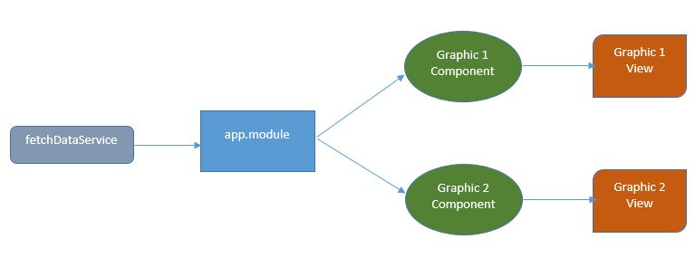
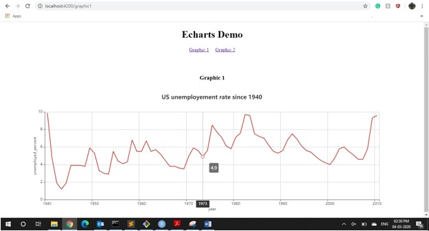
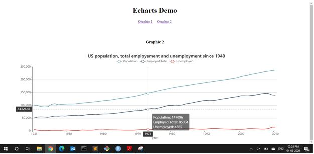

# Echarts Demo

This project was generated with [Angular CLI](https://github.com/angular/angular-cli) version 9.0.4.

## Development server

Run `ng serve` for a dev server. Navigate to `http://localhost:4200/`. The app will automatically reload if you change any of the source files.

## Build

Run `ng build` to build the project. The build artifacts will be stored in the `dist/` directory. Use the `--prod` flag for a production build.

## Further help

To get more help on the Angular CLI use `ng help` or go check out the [Angular CLI README](https://github.com/angular/angular-cli/blob/master/README.md).

## Solution Architecture

Looking at the problem statement I will first install the dependencies that the project require such as Apache ECharts and ngx-charts. After this step I will create a RESTful API service with asynchronous method to retrieve the JSON data by directly accessing the file online and convert the JSON response to javascript understandable format (maps). Next, I will create 2 components namely Graphics 1 and Graphics 2 which will be linked to the main page using routers. Once the basic setup is in place, I will import the Apache Echarts library which was loaded in the first step to recreate the chart for Graphic 1. I will use Echarts' API to access and develop the chart from the data collected. A similar process will be taken to recreate Graphic 2 as well. Both the charts will eventually be published to the view framework of the respective components.

## Results
Graphic 1 and 2 were successfully recreated as seen below

###Garphic 1

###Garphic 2

## Next steps
The code design can further be improved by creating a model for storing chartoptions object as a service. This service can be injected to both the components which can further decorate this object. This way, the application can become scalable for any number of graphic components which would be extended from a single chartoptions model object. Also, the model is separated from controller and view.
